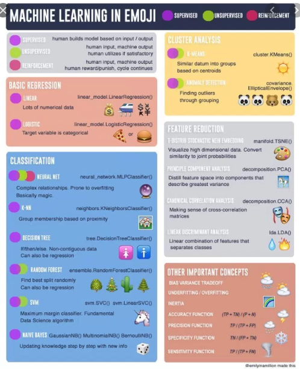

# ML-DL-DS
Projects

##### Deep Learning (DL)
Deep Learning (DL) is an advancement of ML. Even though ML is super powerful for most applications, there are situations where ML leaves a lot to be desired. That is where deep learning steps in. It is generally believed that if your training dataset is relatively small, you go with ML. But if you have huge amounts of data on which you can train a model, and if the data has too many features, and if accuracy is super important (accuracy is always important though), you take the deep learning route.

##### Machine Learning (ML)
Machine Learning (ML) is considered a subset of AI. You can even say that ML is an implementation of AI. So whenever you think of AI, you can think of applying ML there. As the name makes it pretty clear, ML is used in situations where we want the machine to learn from the huge amounts of data we give it, and then apply that knowledge on new pieces of data that streams into the system. But how does a machine learn, you might ask.There are different ways of making a machine learn. Different methods of machine learning are supervised learning, non-supervised learning, semi-supervised learning, and reinforced machine learning.

##### Artificial intelligence
Artificial intelligence, or AI for short, has been around since the mid 1950s. It’s not necessarily new. But it became super popular recently because of the advancements in processing capabilities. Back in the 1900s, there just wasn’t the necessary computing power to realise AI. Today, we have some of the fastest computers the world has ever seen. And the algorithm implementations have improved so much that we can run them on commodity hardware, even your laptop or smartphone that you’re using to read this right now. And given the seemingly endless possibilities of AI, everybody wants a piece of it.

##### Data science
Data science is an interdisciplinary field that uses scientific methods, processes, algorithms and systems to extract knowledge and insights from many structural and unstructured data. Data science is related to data mining and big data
Regression is a statistical method used in finance, investing, and other disciplines that attempts to determine the strength and character of the relationship between one dependent variable (usually denoted by Y) and a series of other variables (known as independent variables).

##### Logistic regression 
In statistics, the logistic regression model is used to model the probability of a certain class or event existing such as pass/fail, win/lose, alive/dead or healthy/sick. This can be extended to model several classes of events such as determining whether an image contains a cat, dog, lion, etc.

###### Some key points
precision is the fraction of relevant instances among the retrieved instances, while recall is the fraction of the total amount of relevant instances that were actually retrieved

* Batch gradient descent: Entire training data is taken so it takes alot of time in weight updates and makes smooth updates
* Mini batch gradient descent: Subset of training data is taken so it takes better time to update weights and we can vary the batch size hence varying the noise in parameter update
* Stochastic gradient descent: Single training sample is taken and makes noisy updates
